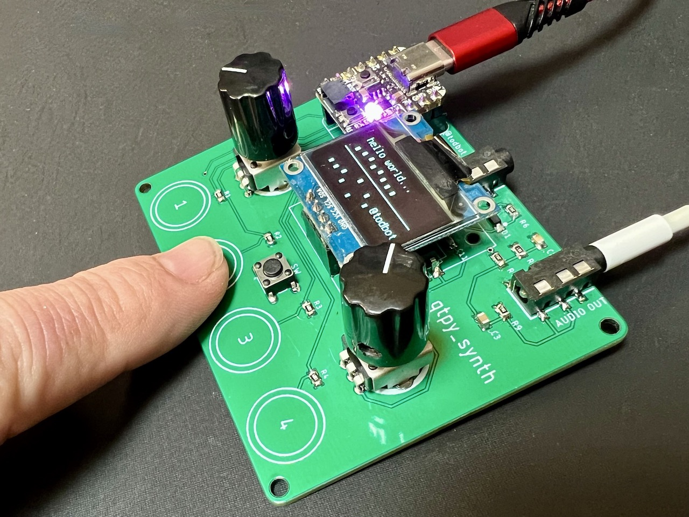
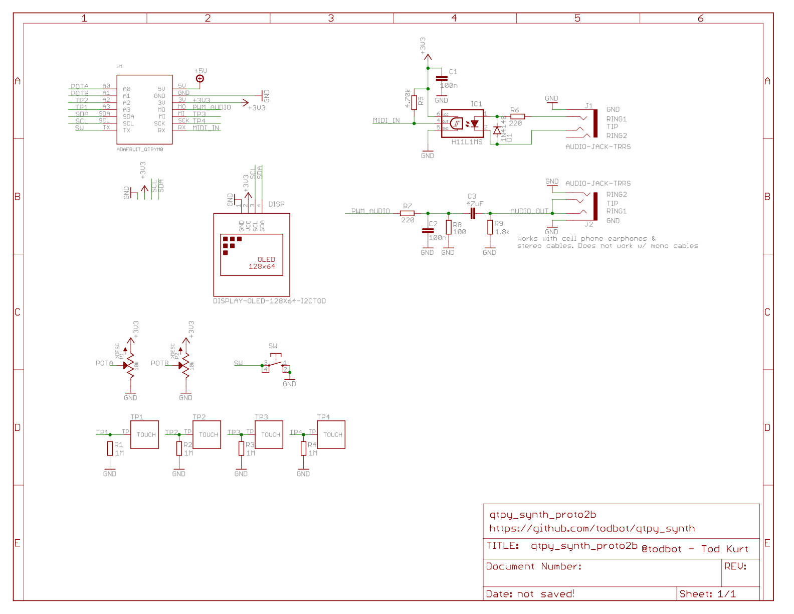

# qtpy_synth

A simple [QTPy RP2040](https://learn.adafruit.com/adafruit-qt-py-2040/overview)-based
synth to experiment with [`synthio`](https://github.com/todbot/circuitpython-synthio-tricks).

### Features
 - Mono audio output circuit, converting PWM to audio, as per [RP2040 design guidelines](https://datasheets.raspberrypi.com/rp2040/hardware-design-with-rp2040.pdf#page=24)
 - Optoisolated MIDI Input via [MIDI TRS-A 3.5mm jack](https://www.perfectcircuit.com/make-noise-0-coast-midi-cable.html)
 - Two pots for controlling parameters
 - One switch for controlling parameters
 - Four capsense touch buttons for synth triggering
 - USB MIDI in/out of course too

### Software
Some programs written specifically for this board:

- [hwtest](https://github.com/todbot/qtpy_synth/tree/main/circuitpython/hwtest/code.py) - test out the hardware with a simple synth

- [simpletouchsynth](https://github.com/todbot/qtpy_synth/tree/main/circuitpython/simpletouchsynth) - play with filters using touch sensors. Uses intial cut at a "qtpy_synth" hardware library.

- [wavesynth](https://github.com/todbot/qtpy_synth/tree/main/circuitpython/wavesynth) - larger general two-osc synth that can also do wave-mixing and wavetables
  - early video demo: ["Wavetable synth w/ CircuitPython synthio on QTPy RP2040"](https://www.youtube.com/watch?v=4hgDi6MNfsI)
  - another demo: ["More Wavetable synth w/ CircuitPython synthio on QTPy RP2040"](https://www.youtube.com/watch?v=80yjwxscnnA)

#### See also:
- https://github.com/todbot/circuitpython-synthio-tricks
  - Contains [many other synthio examples](https://github.com/todbot/circuitpython-synthio-tricks/tree/main/examples) that can work with this synth with minimal changes

### Building it

The [Tindie version is a partially-assembled PCB](https://www.tindie.com/products/todbot/qtpy_synth/).

The completely assembled SMD sections of the board are:

* audio output circuit
* TRS MIDI input circuit

The parts you need to add are:

* [QTPy RP2040](https://www.adafruit.com/product/4900)
* 0.91" [I2C OLED display](https://amzn.to/3KDmy73) (w/ pins in Gnd/Vcc/SCL/SDA order)
* Two 10k potentiometers, 9mm  ([example pots](https://amzn.to/3DYYJm5)) and [knobs](https://amzn.to/3QAkSyR)
* One tact switch, 6mm ([example switch](https://amzn.to/47nJaSN))
* Headers and sockets to mount QTPy & display, to taste
  * [This male & female header kit looks pretty good](https://amzn.to/3qqbtiO),
    as I prefer to put female headers on the PCB and male headers on the QTPy and OLED display.
    You may need to trim down your headers to be the right size.
* Feet. I like M2.5 nylon standoffs  (e.g. [M2.5 standoff asst kit](https://amzn.to/45qVjFb))
  but feel free to do what you like, including making an enclosure!

### Pins used

The board uses all of the QTPy RP2040 pins:

* `board.A0` - left knob
* `board.A1` - right knob
* `board.TX` - middle button
* `board.RX` - TRS UART MIDI in
* `board.MOSI` - PWM Audio Out
* `board.SCL` & `board.SDA` - I2C bus for OLED display
* `board.A3`, `board.A2`, `board.MISO`, `board.SCK`,  -- touch pads 1,2,3,4

For more details see [`hwtest/code.py`](https://github.com/todbot/qtpy_synth/tree/main/circuitpython/hwtest/code.py).

### Schematic

